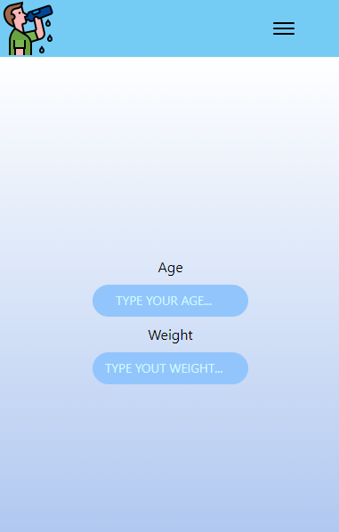
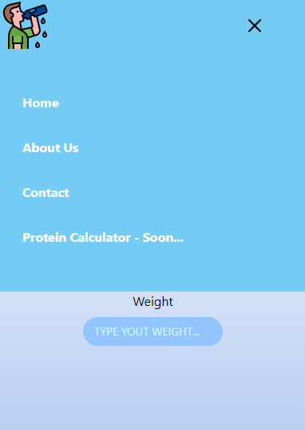

## Welcome again to another React project! 👋

# Vite + React Project

### Home Page
- Calculate Page.



### Menu Mobile
- Open Menu.



## Some code that I'm proud of
```js
const doCalculate = (event) => {

    event.preventDefault()

    const weight = dataWeight.current.value
    const waterNeed = defineWaterNeed()

    const totalWaterNeed = ((waterNeed * weight) / 1000)

    setResult(totalWaterNeed)
    setMlWater(waterNeed)
}
```

## Built with

- REACT + Vite;
- Tailwind;
- Microsoft Excel to make and compare the calculus.

## Test the project yourself: [Teste the project here!!!](https://water-calculator-react-tailwind.vercel.app/){:target="_blank"}

## Author

- Website - [My GitHub](https://github.com/lucasbailo)
- Frontend Mentor - [@lucasbailo](https://www.frontendmentor.io/profile/lucasbailo)
- Instagram - [@lucassbailo](https://www.instagram.com/lucassbailo/)
- LinkedIn - [Lucas Bailo](https://www.linkedin.com/in/lcsbailo)